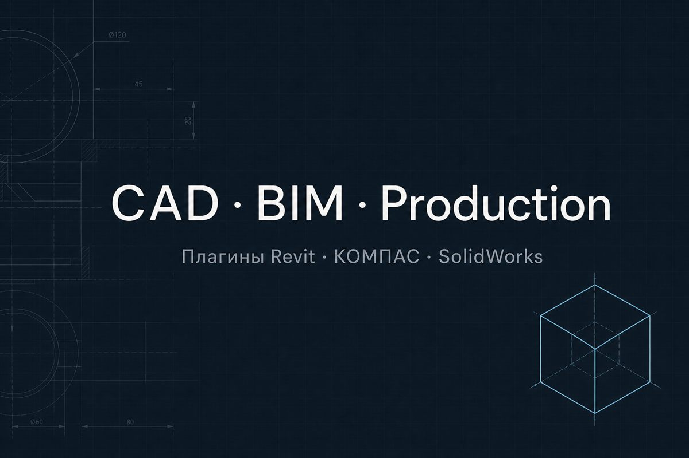

# Portfolio site

Лендинг: разработка ПО для CAD, BIM и производства + резюме конструктора.

[](https://alexpror.github.io/portfolio_site/)

**Сайт:** https://alexpror.github.io/portfolio_site/  
**Релиз:** [v1.0.0](https://github.com/AlexPror/portfolio_site/releases/tag/v1.0.0)

## Страницы

| Путь | Содержание |
|------|------------|
| `/` | Главная: выбор платформы, как работаем, DeskReview, заявка |
| `/kompas` | Кейсы и форма по КОМПАС-3D |
| `/revit` | Кейсы Revit (листы КМД) и форма |
| `/solidworks` | Кейсы SolidWorks (пакет в цех) и форма |
| `/resume` | Резюме (HH-стиль), печать / PDF |

Старый `/app` → редирект на `/#deskreview`.

## Запуск

```bat
run.bat
```

Откроется Vite на порту **5180**. Важный URL (с `base`):

**http://localhost:5180/portfolio_site/**

Без `/portfolio_site/` страница часто пустая — так задумано под GitHub Pages.

Сборка:

```bat
build.bat
```

Превью production: `npm run preview` → http://localhost:4180/portfolio_site/

## Настройка `.env`

Скопируйте `.env.example` → `.env` (в `.gitignore`):

| Переменная | Зачем |
|------------|--------|
| `VITE_TELEGRAM_URL` | Telegram (есть default в коде) |
| `VITE_DESKREVIEW_URL` | Ссылка на DeskReview (по умолчанию [демо](https://alexpror.github.io/3d_viewer_1.0/)) |
| `VITE_WEB3FORMS_KEY` | Форма → почта ([web3forms.com](https://web3forms.com)) |

Без Web3Forms — FormSubmit (нужно подтвердить письмо с почты).

## GitHub Pages

Пуш в `main` → Actions собирает и деплоит.

Один раз: **Settings → Pages → Source: GitHub Actions**.

`base` в Vite: `/portfolio_site/`. При смене имени репо обновите `vite.config.ts`, `robots.txt`, `sitemap.xml`, `index.html`.

## SEO

- OG / Twitter / JSON-LD в `index.html`
- `public/og.jpg`, `.github/social-preview.jpg`
- `robots.txt` + `sitemap.xml` (главная, платформы, резюме)
- Title/description по маршрутам

## Стек

Vue 3 · Vite · TypeScript · Vue Router
